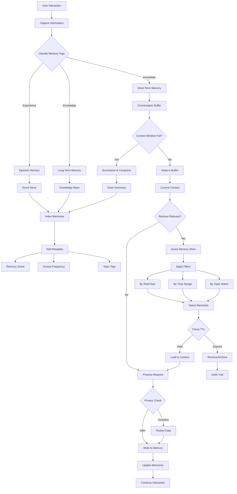

# Memory Management Architecture

A stateful multi-agent system demonstrating the **Memory Management Pattern** using `pydantic-ai` and `pydantic-graph`.

## Project Overview

This project implements a multi-tiered memory orchestration system that allows an agent to maintain conversational continuity, recall user preferences, perform privacy redactions, and compress short-term memory dynamically when context thresholds are reached.

### Architectural Workflow



### Graph Execution Nodes
1. **RetrieveNode (Retrieve Relevant)**: Queries the episodic and long-term memory stores to pull relevant background knowledge and events into the active context.
2. **ProcessNode (Process Request)**: Formulates the personalized assistant response using the query, active conversation buffer, and retrieved memories.
3. **MemoryClassificationNode (Classify & Privacy Check)**: 
   - Uses `MemoryClassifierAgent` to parse the turn.
   - Extracts and categorizes facts into `Short-Term` (Immediate), `Episodic` (Experiences), and `Long-Term` (Knowledge) stores.
   - **Privacy Check**: Ensures sensitive personal information (PII) is either omitted or redacted before storage.
   - If the active conversation buffer reaches its threshold (>= 2 turns), it routes to `CompressNode`.
4. **CompressNode (Context Window Summarization)**:
   - Uses `CompressorAgent` to summarize the detailed short-term buffer turns.
   - Archives the concise summary into the `Long-Term` store and clears the immediate buffer to maintain optimal context window utilization.

## Technology Stack
- **Framework**: [pydantic-ai](https://ai.pydantic.dev/) & [pydantic-graph](https://ai.pydantic.dev/graph/)
- **LLM Provider**: Azure OpenAI
- **Environment**: Python 3.13+, Managed via `uv`

## Project Structure
- `main.py`: Runs a multi-turn showcase highlighting turn-by-turn memory retrieval, storage, privacy check, and active buffer compression.
- `agentic_system/`:
    - `graph.py`: Houses the graph orchestration nodes (`RetrieveNode`, `ProcessNode`, `MemoryClassificationNode`, `CompressNode`).
    - `agents.py`: Implementations for the `ResponderAgent`, `MemoryClassifierAgent`, and `CompressorAgent`.
    - `models.py`: Shared memory structures (`MemoryItem`, `MemoryClassifierOutput`, `State`, and `Dependencies`).
    - `prompts.py`: Roles and system instructions guiding responder persona, memory categorization, privacy rules, and summaries.
    - `config.py`: Azure OpenAI provider configuration.

## Getting Started

1. Configure your `.env` file with Azure OpenAI credentials.
2. Ensure you have dependencies installed (managed automatically via `uv run`).
3. Run the multi-turn memory showcase:
   ```bash
   uv run main.py
   ```
