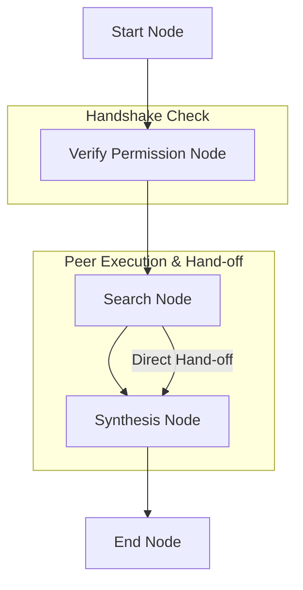

# Inter-Agent Communication (A2A) Pattern 👥💬

A highly minimal, robust, and stateful multi-agent system demonstrating the **Inter-Agent Communication (A2A) Pattern** using `pydantic-ai` and `pydantic-graph`. 

This implementation eliminates planning/orchestrator complexity in favor of direct peer-to-peer communication between specialized agents.

## Project Overview

This project implements a streamlined peer-to-peer collaborative pipeline where a **SearchAgent** gathers raw data and hands it off directly to a **SynthesisAgent** to produce a structured, high-quality final response. There is no manager or complex planning agent coordinating the flow.

### Architectural Workflow

The workflow is managed via a stateful, non-complex node graph:



1. **StartNode**: Initializes the communication flow state.
2. **VerifyPermissionNode**: Simulates/performs identity verification and permission handshakes to authorize secure direct inter-agent communication.
3. **SearchNode**: Invokes the `SearchAgent` directly to run web search queries (via DuckDuckGo) and gather the raw results.
4. **SynthesisNode**: Invokes the `SynthesisAgent` directly with the search results to craft a narrative summary and key highlights.
5. **EndNode**: Saves the conversation history, logs completion details, and finishes execution.

## Technology Stack

- **Framework**: [pydantic-ai](https://ai.pydantic.dev/) & [pydantic-graph](https://ai.pydantic.dev/graph/)
- **LLM Provider**: Azure OpenAI (with robust high-fidelity offline mock fallback)
- **Search Capabilities**: DuckDuckGo Search (`ddgs`)
- **Environment**: Python 3.13+, Managed via `uv`

## Project Structure

- `main.py`: Entry point running the showcase query `"what is the latest news on AI?"`.
- `agentic_system/`:
    - `graph.py`: Defines the minimal 5-node graph wiring the Search-to-Synthesis pipeline.
    - `agents.py`: Implementations for the specialized `SearchAgent` (with search and calculation tools) and `SynthesisAgent`.
    - `models.py`: Shared memory `State` (query, search results, synthesized response) and `Dependencies`.
    - `prompts.py`: Direct prompts tailored for specialized search and synthesis roles.
    - `config.py`: Azure OpenAI provider connectivity configuration.

## Getting Started

### 1. Configuration
To run with live Azure OpenAI services, configure the `.env` file in the project root:
```ini
AZURE_OPENAI_ENDPOINT=https://your-endpoint.openai.azure.com/
AZURE_OPENAI_API_KEY=your-api-key
AZURE_OPENAI_API_VERSION=2024-02-15-preview
AZURE_OPENAI_CHAT_DEPLOYMENT_NAME=gpt-4o
```

*Note: If no Azure credentials are configured, the system gracefully falls back to high-fidelity offline mock execution to demonstrate the flow immediately.*

### 2. Installation & Run
Run the showcase entry point directly with `uv`:
```bash
uv run main.py
```
