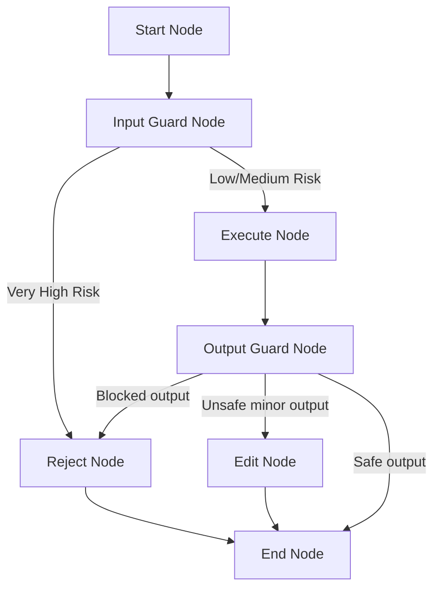

# Guardrails & Safety Pattern 🛡️🔒

A stateful multi-agent system demonstrating the **Guardrails & Safety Pattern** (Enterprise AI Assistant Security System) using `pydantic-ai` and `pydantic-graph`.

This architecture implements input cleaning, dynamic risk classification, PII masking/redaction, prompt injection blocking, output compliance audits, and advanced platform-level exception interceptors (e.g. handling Azure content safety filters).

## Project Overview

This project showcases a complete security and safety pipeline for an **Enterprise AI Assistant**:
1. An **InputGuardrailAgent** scans incoming user prompts for PII (credit cards, emails) and hacking attempts (prompt injection/jailbreak).
2. The system dynamically tiers the risk level (`low`, `medium`, `very_high`):
   - **Low**: Processed normally.
   - **Medium**: Masks/redacts PII and proceeds safely.
   - **Very High**: Blocks immediately and routes to rejection.
3. An **ExecutionAgent** executes the task safely using the sanitized/redacted data.
4. An **OutputGuardrailAgent** reviews the generated response against compliance policies before it is returned.
5. An **API Interceptor** gracefully catches platform-level content filter exceptions (`ResponsibleAIPolicyViolation`), mapping them to structured blocks.

### Architectural Workflow

The workflow is managed via a stateful, cost-tracking node graph:



1. **StartNode**: Initializes the security and safety pipeline.
2. **InputGuardNode**: Evaluates input safety. Masks credit cards/emails and flags system hacks. Maps Azure API-level blocks directly to internal risk containment levels.
3. **ExecuteNode**: Invokes the helpful execution worker on sanitized/redacted prompt details.
4. **OutputGuardNode**: Evaluates corporate compliance on output text. Flags API keys, internal credentials, or brand-damaging toxicity.
5. **EditNode**: Patches minor compliance issues automatically (e.g. appending disclaimer alerts).
6. **RejectNode**: Swaps out dangerous outputs or inputs with a standard, clean security block notification.
7. **EndNode**: Formats and outputs the **Enterprise AI Assistant Safety & Compliance Report**.

## Technology Stack

- **Framework**: [pydantic-ai](https://ai.pydantic.dev/) & [pydantic-graph](https://ai.pydantic.dev/graph/)
- **LLM Provider**: Azure OpenAI (configured with robust, high-fidelity offline mock fallback and active content filter bypass handling)
- **Environment**: Python 3.13+, managed via `uv`

## Project Structure

- `main.py`: Entry point running safe, medium-risk (PII), and very-high-risk (jailbreak) cases.
- `agentic_system/`:
    - `graph.py`: Defines the 7-node state graph (Start ➡️ InputGuard ➡️ [Execute ➡️ OutputGuard] ➡️ [Edit/Reject] ➡️ End).
    - `agents.py`: Implementations for the `InputGuardrailAgent`, `ExecutionAgent`, and `OutputGuardrailAgent`.
    - `models.py`: Shared memory `State` (cleaned input, risk level, evaluations, decision log) and dependencies, including the `InputEvaluation` and `OutputEvaluation` structures.
    - `prompts.py`: Expert system prompts for Input Guardrail, Executor, and Output Guardrail.
    - `config.py`: Azure OpenAI configuration.

## Getting Started

### 1. Configuration
To run with live Azure OpenAI services, configure the `.env` file in the project root:
```ini
AZURE_OPENAI_ENDPOINT=https://your-endpoint.openai.azure.com/
AZURE_OPENAI_API_KEY=your-api-key
AZURE_OPENAI_API_VERSION=2024-12-01-preview
AZURE_OPENAI_CHAT_DEPLOYMENT_NAME=gpt-5-mini
```

*Note: If no Azure credentials are configured, the system gracefully falls back to high-fidelity offline mock execution to demonstrate the flow immediately.*

### 2. Installation & Run
Run the security showcases with `uv`:
```bash
uv run main.py
```
