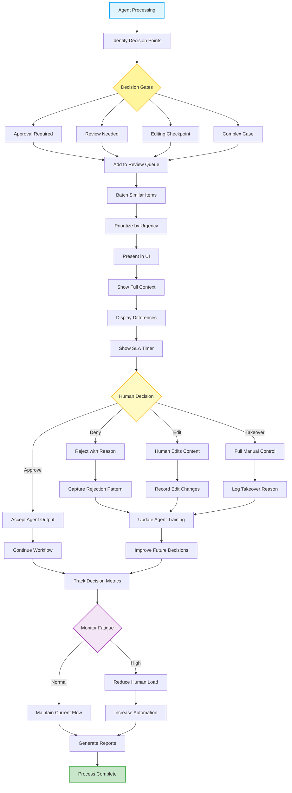

# Human-in-the-Loop (HITL) Pattern 👥🤖

A robust, premium agentic orchestrator implementing the **Human-in-the-Loop (HITL) Design Pattern** powered by `pydantic-ai` and `pydantic-graph`. 

The system governs complex multi-agent workflows through error-resilient structures: conducting operations, routing decisions to specific gates (Approve, Review, Edit, Complex), batching and prioritizing human operator queues, rendering modern developer-oriented UI summaries with SLAs, intercepting human actions (Accept, Reject, Edit, Takeover), capturing continuous training feedback to automatically reinforce system prompts, and dynamically balancing reviewer fatigue by automatically throttling load and adjusting AI automation thresholds.

---

## 🌟 Modern Design Pattern Architecture

Rather than operating entirely autonomously or requiring cumbersome manual intervention for every step, this system acts as a smart, load-balanced coordinator between agent autonomy and human oversight:



---

## 🛠️ Orchestrator State Machine Nodes

The orchestrator utilizes **Pydantic Graph** to govern state transitions through 22 robust, self-documenting node structures:

1. **`StartNode`**: Initiates the agent processing cycle.
2. **`IdentifyDecisionPointsNode`**: Evaluates incoming query context using the **Decision Gate Agent** to categorize the operation into specific gates.
3. **`AddReviewQueueNode`**: Batches and prioritizes the task by urgency.
4. **`UIPresentationNode`**: Formulates a detailed operator card complete with context summaries, diff comparisons, and SLA timers using the **UI Presenter Agent**.
5. **`HumanDecisionNode`**: Intercepts physical user actions (simulated or live operator keypresses/mouse clicks).
6. **`AcceptAgentOutputNode` / `RejectWithReasonNode` / `HumanEditsContentNode` / `FullManualControlNode`**: Specific nodes corresponding to the four primary decision branches.
7. **`UpdateAgentTrainingNode`**: Extracts negative reinforcement, edits, or manual overrides and feeds them to the **Feedback Learning Agent**.
8. **`ImproveFutureDecisionsNode`**: Synthesizes the corrections and dynamically appends new, specific guidelines/prompts to the AI agent.
9. **`MonitorFatigueNode`**: Audits operator stress levels (SLA delays, throughput logs) using the **Fatigue Monitor Agent**.
10. **`ReduceHumanLoadNode` / `IncreaseAutomationNode`**: Initiates SRE workload safety overrides: throttles human queues and bumps the system's baseline AI automation rate from `50%` to `85%` (offloading manual reviews).
11. **`GenerateReportsNode` / `EndNode`**: Generates a beautiful SRE operational report and consolidates continuous learning logs.

---

## 🚀 Getting Started

### 📋 Prerequisites

- **Python 3.11+** (Python 3.13 recommended)
- **Azure OpenAI Service API** (Optional; high-fidelity offline fallback mocks are enabled automatically if credentials are not provided).

### ⚙️ Quick Installation

1. **Clone the repository and activate virtual environment**:
   ```powershell
   python -m venv .venv
   .venv\Scripts\Activate.ps1
   ```

2. **Install project dependencies**:
   ```powershell
   pip install -e .
   ```

3. **Configure Environment Variables**:
   Create a `.env` file in the root directory to run with Azure OpenAI models:
   ```env
   AZURE_OPENAI_ENDPOINT=https://your-endpoint.openai.azure.com/
   AZURE_OPENAI_API_KEY=your-api-key
   AZURE_OPENAI_API_VERSION=2024-12-01-preview
   AZURE_OPENAI_CHAT_DEPLOYMENT_NAME=gpt-4o-mini
   ```

---

## 🧪 Running the Showcase

To run the four high-fidelity reliability simulations, execute:

```powershell
python main.py
```

### 🔁 The Four Simulated Showcases

1. **Scenario 1: Human Approval (Approve Branch)**:
   - *Task*: Reviewing a standard SRE guidelines marketing blog draft.
   - *Gate*: `Approval Required` (Low Urgency).
   - *Resolution*: Reviewer approves the output as compliant. System registers `0.22` fatigue score, maintaining baseline 50% automation.

2. **Scenario 2: Human Denial & Learning (Deny Branch)**:
   - *Task*: Evaluating a resume screening submission.
   - *Gate*: `Review Needed` (Medium Urgency).
   - *Resolution*: Reviewer rejects the output because the candidate lacks required senior native Rust experience. The SRE learning loop captures the rejection reason and automatically appends a strict language validation constraint to the agent prompts to improve future autonomous screenings.

3. **Scenario 3: Human Editing (Edit Branch)**:
   - *Task*: French translation quality checkpoint.
   - *Gate*: `Editing Checkpoint` (Medium Urgency).
   - *Resolution*: Reviewer polishes the translation draft. SRE learning loop logs the differences between the agent draft and human edit, updating the agent's prompts to prioritize colloquial phrasing and native usage.

4. **Scenario 4: Manual Takeover & Fatigue Auto-Balance (Takeover/Overload Branch)**:
   - *Task*: Authorizing a wire transfer refund of $12,500.00.
   - *Gate*: `Complex Case` (High Urgency).
   - *Resolution*: Amount exceeds standard agent credit limits ($10,000). A senior compliance officer manual takeover is triggered. Reviewer fatigue scores spike to `0.85` (overload alert). The orchestrator automatically throttles the human review queues and escalates the AI automation rate to `85%` (up from 50%) to immediately offload operator burden.

---

## 📂 Project Structure

```
├── agentic_system/
│   ├── __init__.py
│   ├── config.py       # Configuration and Azure OpenAI client setup
│   ├── models.py       # Pydantic schemas: Gating, Human Decisions, Feedback, State
│   ├── prompts.py      # System prompts for gating, UI queue presentation, and learning loops
│   ├── agents.py       # High-fidelity classes for Decision Gate, UI, Feedback, and Fatigue Agents
│   └── graph.py        # complete pydantic-graph state machine wiring (22 nodes)
├── main.py             # Entrypoint driving the four sequential showcases
├── README.md           # Premium SRE documentation
├── about.md            # Human-in-the-Loop pattern guide
└── diagram.mmd         # Mermaid flowchart diagram
```

---

## 🛡️ Robust Portability & Fallbacks

- **High-Fidelity Mocks**: Automatically active when `AZURE_OPENAI_API_KEY` is not present in `.env`, replicating identical self-healing telemetry, structured logs, and fatigue spikes offline.
- **Pydantic Validation Retries**: Wrapper agents use configured validation retries to guarantee 100% reliable structured tool-calling schema parsing across LLMs.
- **Fatigue Monitoring**: Provides an active load-balancing safety system that prevents human reviewer burnout under queue overload conditions.
