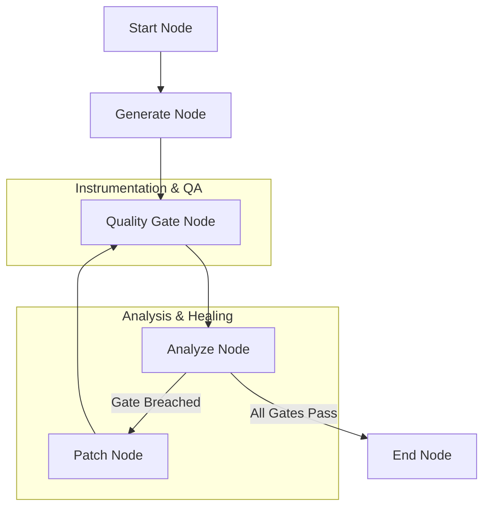

# Evaluation & Monitoring Pattern 📊🔍

A stateful multi-agent system demonstrating the **Evaluation & Monitoring Pattern** (Self-Healing QA Pipeline) using `pydantic-ai` and `pydantic-graph`.

This architecture implements automated quality gates (compilation and unit tests), instruments performance SLAs (latency and costs), triggers threshold breach alerts, and executes closed-loop healing to patch buggy code and verify recovery.

## Project Overview

This project showcases an evaluation and monitoring pipeline for a **Code Generation Tool**:
1. A **CodeGeneratorAgent** generates a Python function based on user requirements.
2. A **Quality Gate** compiles and runs unit tests against the generated code in a sandbox environment.
3. A **Monitoring System** captures latency, compilation logs, cost metrics, and test pass rates.
4. An **Alerting Engine** generates warning or critical alerts when thresholds are breached.
5. A **CodeCorrectorAgent** is automatically invoked to patch the code if gates fail, re-submitting it to verify recovery in a closed loop.

### Architectural Workflow

The workflow is managed via a stateful, cost-tracking node graph:



1. **StartNode**: Initializes the evaluation and monitoring processing pipeline.
2. **GenerateNode**: Invokes the `CodeGeneratorAgent` to draft a code solution.
3. **QualityGateNode**: Standardizes system instrumentation. Compiles the code using `compile` and executes assertion statements in a sandbox namespace. Computes execution cost and gate latency.
4. **AnalyzeNode**: Checks metrics against SLAs. Triggers warning/critical alerts for compilation syntax errors, test failures, or latency breaches. If a breach is found, routes to `PatchNode`. If successful, routes to `EndNode`.
5. **PatchNode**: Invokes `CodeCorrectorAgent` with detailed error traces to repair the code. Re-submits to `QualityGateNode` to close the loop.
6. **EndNode**: Compiles and outputs a comprehensive **System Quality Gate & Monitoring Audit Report** showing iteration history, cost aggregates, and recovery status.

## Technology Stack

- **Framework**: [pydantic-ai](https://ai.pydantic.dev/) & [pydantic-graph](https://ai.pydantic.dev/graph/)
- **LLM Provider**: Azure OpenAI (configured with robust, high-fidelity offline mock fallback)
- **Environment**: Python 3.13+, managed via `uv`

## Project Structure

- `main.py`: Entry point running the showcase on healthy (Addition) and self-healing (Fibonacci) code tasks.
- `agentic_system/`:
    - `graph.py`: Defines the 6-node state graph (Start ➡️ Generate ➡️ QualityGate ➡️ Analyze ➡️ [Patch] ➡️ End).
    - `agents.py`: Implementations for `CodeGeneratorAgent` and `CodeCorrectorAgent`.
    - `models.py`: Shared memory `State` (metrics history, active alerts, prompts, unit tests, code) and dependencies, including the `MetricSummary` and `AlertInfo` structures.
    - `prompts.py`: Optimized system prompts for generator and corrector.
    - `config.py`: Azure OpenAI configuration.

## Getting Started

### 1. Configuration
To run with live Azure OpenAI services, configure the `.env` file in the project root:
```ini
AZURE_OPENAI_ENDPOINT=https://your-endpoint.openai.azure.com/
AZURE_OPENAI_API_KEY=your-api-key
AZURE_OPENAI_API_VERSION=2024-12-01-preview
AZURE_OPENAI_CHAT_DEPLOYMENT_NAME=gpt-5-mini
```

*Note: If no Azure credentials are configured, the system gracefully falls back to high-fidelity offline mock execution to demonstrate the flow immediately.*

### 2. Installation & Run
Run the evaluation and monitoring showcases with `uv`:
```bash
uv run main.py
```
