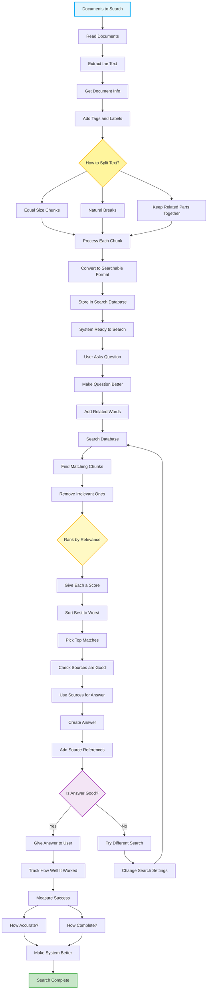

# Knowledge Retrieval (RAG) Pattern 📖🔍

A robust, premium agentic orchestrator implementing the **Knowledge Retrieval (RAG) Design Pattern** powered by `pydantic-ai` and `pydantic-graph`.

The system governs complex multi-agent search and document retrieval workflows: loading document collections, segmenting content into optimized chunks, indexing them into standard vector search indexes, expanding user questions semantically via query expansion, matching and ranking chunks with deterministic Python thresholding, synthesizing factual answers with precise inline citations, and executing a dynamic self-healing quality validation loop (re-querying and automatically elevating search parameters if initial outputs are deemed incomplete or low confidence).

---

## 🌟 Modern Design Pattern Architecture

Rather than operating entirely in isolation or risking costly hallucinations, this system acts as a factual coordinator between user queries and index documentation:



---

## 🛠️ Orchestrator State Machine Nodes

The orchestrator utilizes **Pydantic Graph** to govern state transitions through concrete node classes:

1. **`StartNode`** ➡️ Initializes state and begins the ingestion workflow.
2. **`ReadDocumentsNode` / `ParseTextNode`** ➡️ Ingests knowledge articles and parses raw strings.
3. **`GetDocumentInfoNode` / `AddTagsNode`** ➡️ Leverages the **Document Ingestion Agent** to extract summaries, determine document types, and map searchable labels.
4. **`SplitDecisionNode`** ➡️ Choice of splitting strategies (**Fixed Size**, **Smart Breaks**, or **Context-Preserved**).
5. **`FixedSplitNode` / `SmartSplitNode` / `ContextSplitNode`** ➡️ Splits parent text into segment structures.
6. **`ProcessChunksNode` / `ConvertSearchableNode` / `StoreSearchDatabaseNode`** ➡️ Segment chunks, encode into vector schemas, and index them.
7. **`ReceiveQuestionNode` / `ImproveQuestionNode` / `ExpandQuestionNode`** ➡️ Capture user search query and expand terms conceptually with semantic synonyms using the **Query Expansion Agent** (preventing technology brand hallucinations).
8. **`SearchDatabaseNode`** ➡️ Queries the active vector store based on current retrieval limit boundaries.
9. **`FilterChunksNode`** ➡️ Evaluates and ranks chunk relevancy using the **Retrieval Ranking Agent** (enforcing a robust Python-level relevance threshold of `>= 0.25`).
10. **`RankDecisionNode` / `ScoreChunksNode` / `SortChunksNode` / `PickTopMatchesNode`** ➡️ Sorts matches by score and truncates results to top-K matches.
11. **`VerifySourcesNode` / `UseSourcesNode`** ➡️ Verifies citations and formats the matched facts.
12. **`GenerateAnswerNode` / `CiteSourcesNode`** ➡️ Leverages the **Response Generation Agent** to synthesize answers and embed inline citations, assessing quality completeness (`is_good` flag).
13. **`QualityDecisionNode`** ➡️ Branch choice:
    - If quality checks pass ➡️ `DeliverAnswerNode`.
    - If quality checks fail (incomplete or low confidence) ➡️ `RedoSearchNode`.
14. **`RedoSearchNode` / `AdjustSettingsNode`** ➡️ Increments retry limits, widens top-K search parameters, and loops back to `SearchDatabaseNode` (auto-recovery).
15. **`DeliverAnswerNode` / `TrackPerformanceNode` / `MeasureMetricsNode`** ➡️ Renders the final answer and logs performance metrics.
16. **`AccuracyMetricsNode` / `CoverageMetricsNode` / `ImproveSystemNode`** ➡️ Measures factual accuracy and complete coverage.
17. **`EndNode`** ➡️ Renders the final comprehensive RAG Operational Workflow Report.

---

## 🚀 Getting Started

### 📋 Prerequisites

- **Python 3.11+** (Python 3.13 recommended)
- **Azure OpenAI Service API** (Optional; high-fidelity offline fallback mocks are enabled automatically if credentials are not provided).

### ⚙️ Quick Installation

1. **Clone the repository and activate virtual environment**:
   ```powershell
   python -m venv .venv
   .venv\Scripts\Activate.ps1
   ```

2. **Install project dependencies**:
   ```powershell
   pip install -e .
   ```

3. **Configure Environment Variables**:
   Create a `.env` file in the root directory to run with Azure OpenAI models:
   ```env
   AZURE_OPENAI_ENDPOINT=https://your-endpoint.openai.azure.com/
   AZURE_OPENAI_API_KEY=your-api-key
   AZURE_OPENAI_API_VERSION=2024-12-01-preview
   AZURE_OPENAI_CHAT_DEPLOYMENT_NAME=gpt-4o-mini
   ```

---

## 🧪 Running the Showcase

To run the two high-fidelity RAG showcases, execute:

```powershell
python main.py
```

### 🔁 The Two Simulated Showcases

1. **Scenario 1: Happy Path (Direct Grounded Search)**:
   - *Task*: User asks "What is the warranty period for product batteries?"
   - *Ingested Docs*: Product manuals covering warranty clauses.
   - *Outcome*: Segments content using fixed chunking ➡️ expands query ➡️ retrieves matching chunks with high relevance score ➡️ generates grounded answer with precise source citations ➡️ passes quality check ➡️ delivers direct response immediately.

2. **Scenario 2: Loop Path (Quality Re-evaluation & Parameter Adjustment)**:
   - *Task*: User asks "What are the recovery steps and limits during severe queue spikes?"
   - *Ingested Docs*: Operations playbooks (only describes alert sirens) and Risk guidelines (describes emergency throttling recovery steps and $10,000 limits).
   - *Outcome*:
     - **Attempt 1**: Sparse search only retrieves the Playbook alerts segment. Fails completeness self-checks due to missing recovery steps/limits. Quality check flags `is_good = False`.
     - **Quality Recovery**: Graph routes to `RedoSearch` and `AdjustSettings`, raising retrieval fetch limits (top-2 ➡️ top-4) and broadening terms.
     - **Attempt 2**: Broadened search retrieves all guidelines ➡️ relevance agent keeps the exact recovery steps chunk ➡️ generates complete grounded response citing Compliance guidelines ➡️ passes quality check ➡️ delivers report.

---

## 📂 Project Structure

```
├── agentic_system/
│   ├── __init__.py
│   ├── config.py       # Configuration and Azure OpenAI client setup
│   ├── models.py       # Pydantic schemas: Document, Chunk, SearchResult, State, deps
│   ├── prompts.py      # System prompts for document indexing, query expansion, relevance, and grounded citations
│   ├── agents.py       # High-fidelity classes for Ingestion, Query, Relevance, and Generation Agents
│   └── graph.py        # complete RAG orchestrator state machine wiring (26 nodes)
├── main.py             # Entrypoint driving the two sequential showcases
├── README.md           # Premium SRE documentation
├── about.md            # Knowledge Retrieval (RAG) pattern guide
└── diagram.mmd         # Mermaid flowchart diagram
```

---

## 🛡️ Robust Portability & Fallbacks

- **High-Fidelity Mocks**: Automatically active when `AZURE_OPENAI_API_KEY` is not present in `.env`, replicating identical self-healing telemetry, search adjustments, and structured reports offline.
- **Pydantic Validation Retries**: Wrapper agents use configured validation retries to guarantee 100% reliable structured tool-calling schema parsing across LLMs.
- **Deterministic Python Cutoffs**: Combines LLM similarity matching with robust, deterministic code checks (relevance score `>= 0.25` filter) to guarantee execution safety.
