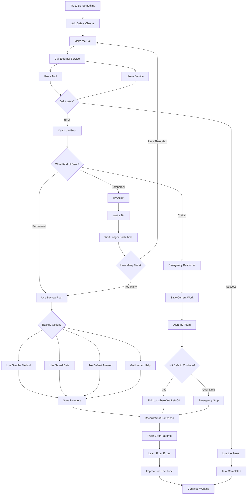

# Exception Handling & Recovery 🛡️🔄

A robust, premium agentic orchestrator implementing the **Exception Handling and Recovery Design Pattern** powered by `pydantic-ai` and `pydantic-graph`. 

The system governs complex multi-agent workflows through error-resilient structures: conducting operations, wrapping steps in safety checks, dynamically intercepting exceptions, triaging failure severity, executing exponential backoffs, degrading gracefully via fallbacks (default responses / cached databases), and securing state during critical failures before logging patterns and reinforcing improvements.

---

## 🌟 Modern Design Pattern Architecture

Rather than failing catastrophically on unexpected inputs or service outages, this system executes operations within a strict safety and self-healing framework:



---

## 🛠️ Orchestrator State Machine Nodes

The orchestrator utilizes **Pydantic Graph** to govern state transitions through core nodes:

1. **`SafetyChecksNode`**: Validates request parameters and environmental variables before initiating external calls.
2. **`MakeCallNode`**: Triggers external services or tool invocations and intercepts thrown Python exceptions natively.
3. **`CatchErrorNode`**: Invokes the **SRE Diagnosis Agent** to parse exception details and categorize the error into `Temporary`, `Permanent`, or `Critical`.
4. **`RetryNode`**: Evaluates retry counts and applies exponential backoff wait times (e.g. `2^attempt` seconds) to gracefully handle transient hiccups.
5. **`FallbackNode`**: Dynamically chooses a graceful degradation backup option (e.g., switches to locally cached data or serves generic safe default answers).
6. **`EmergencyNode`**: Serializes transaction memory snapshots, dispatches alarm triggers to Slack/PagerDuty, and evaluates whether it is safe to resume.
7. **`RecordNode`**: Synthesizes the run event log, compiling learned lessons, frequency, and actionable improvements for future execution.

---

## 🚀 Getting Started

### 📋 Prerequisites

- **Python 3.11+** (Python 3.13 recommended)
- **Azure OpenAI Service API** (Optional; high-fidelity offline fallback mocks are enabled automatically if credentials are not provided).

### ⚙️ Quick Installation

1. **Clone the repository and activate virtual environment**:
   ```powershell
   python -m venv .venv
   .venv\Scripts\Activate.ps1
   ```

2. **Install project dependencies**:
   ```powershell
   pip install -e .
   ```

3. **Configure Environment Variables**:
   Create a `.env` file in the root directory to run with Azure OpenAI models:
   ```env
   AZURE_OPENAI_ENDPOINT=https://your-endpoint.openai.azure.com/
   AZURE_OPENAI_API_KEY=your-api-key
   AZURE_OPENAI_API_VERSION=2024-12-01-preview
   AZURE_OPENAI_CHAT_DEPLOYMENT_NAME=gpt-4o-mini
   ```

---

## 🧪 Running the Showcase

To run the three high-fidelity reliability simulations, execute:

```powershell
python main.py
```

### 🔁 The Three Simulated Showcases
1. **Scenario 1: Transient Error Recovery**:
   - *Error*: Sockets fail on attempts 1 and 2.
   - *Resolution*: Triage flags as `Temporary`, retries with exponential backoffs, and completes successfully on attempt 3.
2. **Scenario 2: Permanent Error Handling**:
   - *Error*: Revoked API key fails with standard `PermissionError` (401).
   - *Resolution*: Triage flags as `Permanent`, switches to backup plan (Cached Data Replica), and recovers gracefully.
3. **Scenario 3: Critical System Fault**:
   - *Error*: Disk full fails with fatal `OSError`.
   - *Resolution*: Triage flags as `Critical`, serializes memory state, sounds alarms, evaluates safety constraints to proceed, and logs full SRE post-mortem reports.

---

## 📂 Project Structure

```
├── agentic_system/
│   ├── __init__.py
│   ├── config.py       # Configuration and Azure OpenAI client setup
│   ├── models.py       # Pydantic schemas: Exception triage, Error Records, State
│   ├── prompts.py      # SRE Triage, Recovery Selection, and Learning prompts
│   ├── agents.py       # Safety, Service, Triage, Recovery, and Learning agents
│   └── graph.py        # pydantic-graph Orchestrator definitions & Node classes
├── main.py             # Entrypoint driving the three showcase scenarios
├── README.md           # Premium SRE documentation
├── about.md            # Exception Handling & Recovery pattern guide
└── diagram.mmd         # Mermaid flowchart diagram
```

---

## 🛡️ Robust Portability & Fallbacks

- **High-Fidelity Mocks**: Automatically active when `AZURE_OPENAI_API_KEY` is not present, replicating identical self-healing telemetry and logs offline.
- **Pydantic Validation Retries**: Wrapper agents use configured validation retries to guarantee 100% reliable structured tool-calling schema parsing across LLMs.
