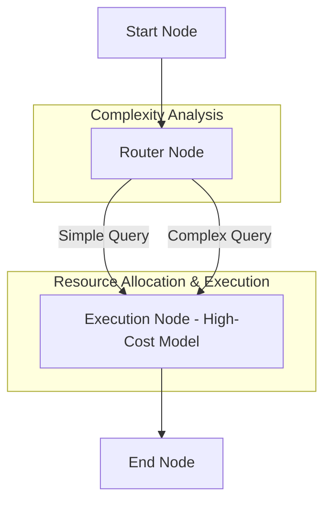

# Resource-Aware Optimization Pattern 💰⚡

A stateful multi-agent system demonstrating the **Resource-Aware Optimization Pattern** (Cost-Aware Routing) using `pydantic-ai` and `pydantic-graph`. 

This architecture balances output quality and API execution cost by dynamically analyzing user query complexity and routing the task to the most resource-efficient model tier.

## Project Overview

This project implements a resource-optimized routing pipeline. When a user sends a query, a **RouterAgent** classifies the task into a complexity tier. The task is then executed by the **ExecutionAgent** configured with a custom prompt tailored for that tier, demonstrating model performance differences and estimating operational cost savings.

### Architectural Workflow

The workflow is managed via a stateful, cost-tracking node graph:



1. **StartNode**: Initializes the cost-aware processing pipeline state.
2. **RouterNode**: Invokes the `RouterAgent` to classify query complexity as `simple` or `complex` based on semantics, reasoning steps, and task scope.
3. **ExecutionNode**: Invokes the `ExecutionAgent` using the selected model tier. It dynamically selects the system prompt persona (e.g., highly concise for low-cost, thorough and analytical for high-cost), tracks input/output tokens, and calculates operational run costs.
4. **EndNode**: Compiles and outputs a detailed **Resource Optimization Report** displaying estimated run costs and dollar savings (against always executing on the most expensive model).

## Technology Stack

- **Framework**: [pydantic-ai](https://ai.pydantic.dev/) & [pydantic-graph](https://ai.pydantic.dev/graph/)
- **LLM Provider**: Azure OpenAI (with robust high-fidelity offline mock fallback)
- **Environment**: Python 3.13+, Managed via `uv`

## Project Structure

- `main.py`: Entry point running sequential simple (math calculation) and complex (economic essay) showcases.
- `agentic_system/`:
    - `graph.py`: Defines the 4-node state graph (Start ➡️ Router ➡️ Execution ➡️ End).
    - `agents.py`: Implementations for the structured `RouterAgent` (determining complexity) and persona-differentiated `ExecutionAgent`.
    - `models.py`: Shared memory `State` (complexity, selected model, response content, cost metrics) and `Dependencies`.
    - `prompts.py`: Optimized system prompts for router classification and low/high cost worker personas.
    - `config.py`: Azure OpenAI configuration.

## Getting Started

### 1. Configuration
To run with live Azure OpenAI services, configure the `.env` file in the project root:
```ini
AZURE_OPENAI_ENDPOINT=https://your-endpoint.openai.azure.com/
AZURE_OPENAI_API_KEY=your-api-key
AZURE_OPENAI_API_VERSION=2024-02-15-preview
AZURE_OPENAI_CHAT_DEPLOYMENT_NAME=gpt-4o
```

*Note: If no Azure credentials are configured, the system gracefully falls back to high-fidelity offline mock execution to demonstrate the flow immediately.*

### 2. Installation & Run
Run the sequential showcases with `uv`:
```bash
uv run main.py
```
