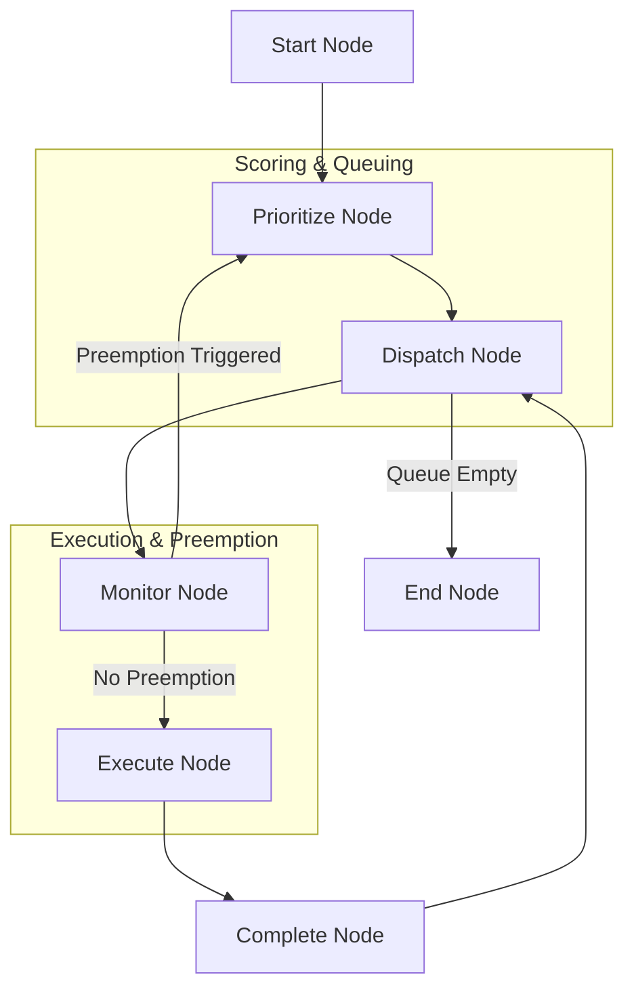

# Stateful Prioritization & Preemption Pattern ⏳⚡

A stateful multi-agent system demonstrating the **Prioritization Pattern** (Support Ticket Prioritizer & Stateful Orchestrator) using `pydantic-ai` and `pydantic-graph`.

This architecture implements multi-factor priority scoring, task aging (starvation prevention), dynamic priority queues, and live task preemption with state progress saving when new events arrive.

## Project Overview

This project showcases a priority-based scheduling pipeline for a **Customer Support System**:
1. A **PrioritizerAgent** evaluates support tickets, assigning scores to Business Value (Tier), Urgency, Risk, and Effort.
2. The orchestrator calculates the final Priority Score:  
   $$\text{Priority} = \frac{\text{Value}}{\text{Effort}} \times \text{Urgency} \times \text{Risk}$$
3. **Starvation Prevention (Task Aging)** is applied. Older, standard tasks waiting in the queue (>30 days) receive an **Aging Boost** (+15.0 priority score) so they are not permanently starved by newer, high-value tasks.
4. An **Execution Loop** pops the highest priority task and executes it.
5. **Runtime Preemption & State Saving**: If a critical new task (e.g. a premium database crash) arrives mid-run, the currently running task is preempted. The system saves its current progress state (40% complete), pushes it back to the queue, and reschedules.

### Architectural Workflow

The workflow is managed via a stateful, cost-tracking node graph:



1. **StartNode**: Initializes the support ticket queue.
2. **PrioritizeNode**: Performs structured priority evaluations and applies **Task Aging** score boosts. Sorts the queue in descending score order.
3. **DispatchNode**: Pops the top-priority ticket from the queue.
4. **MonitorNode**: Simulates runtime events. Checks if the incoming ticket has a higher score than the running task. If yes, preempts the running task, saves its progress (40%), returns both to the queue, and routes to `PrioritizeNode`.
5. **ExecuteNode**: Resolves the running ticket using the support agent, completing it to 100% progress.
6. **CompleteNode**: Moves the ticket to the completed archive.
7. **EndNode**: Formats and outputs the **Stateful Priority Queue & Dispatch Audit Report**.

## Technology Stack

- **Framework**: [pydantic-ai](https://ai.pydantic.dev/) & [pydantic-graph](https://ai.pydantic.dev/graph/)
- **LLM Provider**: Azure OpenAI (configured with robust, high-fidelity offline mock fallback)
- **Environment**: Python 3.13+, managed via `uv`

## Project Structure

- `main.py`: Entry point running the queue, injecting a preemption event, and logging results.
- `agentic_system/`:
    - `graph.py`: Defines the 7-node state graph (Start ➡️ Prioritize ➡️ Dispatch ➡️ Monitor ➡️ Execute ➡️ Complete ➡️ End).
    - `agents.py`: Implementations for the `PrioritizerAgent` and `SupportWorkerAgent`.
    - `models.py`: Shared memory `State` (ticket queue, running task, completed tasks, logs) and dependencies, including the `SupportTicket` and `PriorityScoreCard` structures.
    - `prompts.py`: Optimized system prompts for prioritizer and support worker.
    - `config.py`: Azure OpenAI configuration.

## Getting Started

### 1. Configuration
To run with live Azure OpenAI services, configure the `.env` file in the project root:
```ini
AZURE_OPENAI_ENDPOINT=https://your-endpoint.openai.azure.com/
AZURE_OPENAI_API_KEY=your-api-key
AZURE_OPENAI_API_VERSION=2024-12-01-preview
AZURE_OPENAI_CHAT_DEPLOYMENT_NAME=gpt-5-mini
```

*Note: If no Azure credentials are configured, the system gracefully falls back to high-fidelity offline mock execution to demonstrate the flow immediately.*

### 2. Installation & Run
Run the prioritization showcases with `uv`:
```bash
uv run main.py
```
