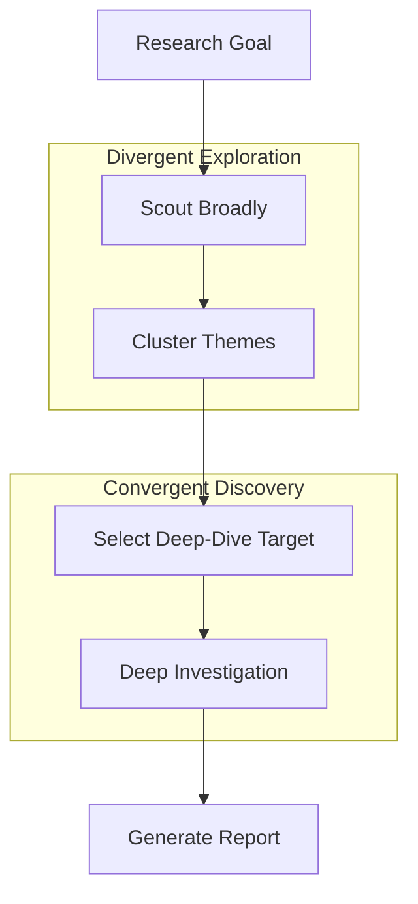

# Exploration & Discovery Pattern 🔬🗺️

A stateful multi-agent system demonstrating the **Exploration & Discovery Pattern** (Scientific Literature Scout & Hypothesis Generator) using `pydantic-ai` and `pydantic-graph`.

This architecture implements broad literature scouting, conceptual mapping and thematic clustering, structured multi-criteria selection (Novelty, Impact, Feasibility, Gaps), target deep-diving, and conceptual research artifact extraction.

## Project Overview

This project showcases a complete literature-mining and discovery pipeline for a **Scientific Research Assistant**:
1. A **ScoutAgent** searches broadly across academic papers, patents, and web resources for a given research goal.
2. A **ClusteringAgent** maps the knowledge space, grouping the scouted sources into emerged conceptual themes.
3. A **TargetSelectorAgent** evaluates each theme against four selection criteria:
   - **Novelty Score**: Uniqueness of the research area.
   - **Potential Impact**: Magnitude of scientific or industrial transformation.
   - **Feasibility**: Practical viability versus science-fiction speculation.
   - **Knowledge Gaps**: Extent of unexplored territory in the field.
4. The system ranks the themes and selects the highest-scoring target.
5. A **DeepDiveSpecialistAgent** executes a deep investigation into the target and extracts structured research artifacts: **Research Notes (Conceptual Models)**, **Curated Bibliographies**, and **Formulated Testable Hypotheses**.

### Architectural Workflow

The workflow is managed via a stateful, cost-tracking node graph:



1. **StartNode**: Sets the scientific research goal or technological scouting topic.
2. **ScoutNode**: Broadly scouts sources (academic articles, patent records, research briefs) and saves key findings to `State.sources`.
3. **ClusterNode**: Concepts-maps and organizes the sources into emerged thematic groups, grouping associated articles together.
4. **SelectNode**: Evaluates all themes on Novelty, Impact, Feasibility, and Gaps. Selects the highest-rated theme for investigation.
5. **DeepDiveNode**: Conducts deep investigation into the selected theme, formulating testable scientific hypotheses and compiling a reference bibliography.
6. **EndNode**: Formats and outputs the **Scientific Discovery & Technology Scouting Report**.

## Technology Stack

- **Framework**: [pydantic-ai](https://ai.pydantic.dev/) & [pydantic-graph](https://ai.pydantic.dev/graph/)
- **LLM Provider**: Azure OpenAI (configured with robust, high-fidelity offline mock fallback)
- **Environment**: Python 3.13+, managed via `uv`

## Project Structure

- `main.py`: Entry point running the showcase on next-generation battery chemistries beyond Lithium-ion.
- `agentic_system/`:
    - `graph.py`: Defines the 6-node state graph (Start ➡️ Scout ➡️ Cluster ➡️ Select ➡️ DeepDive ➡️ End).
    - `agents.py`: Implementations for the `ScoutAgent`, `ClusteringAgent`, `TargetSelectorAgent`, and `DeepDiveSpecialistAgent`.
    - `models.py`: Shared memory `State` (sources, themes, evaluations, artifacts) and dependencies, including the `ScoutedSource`, `ClusteredTheme`, `ThemeEvaluation`, and `DeepDiveArtifacts` structures.
    - `prompts.py`: Optimized system prompts for scouting, clustering, selection, and deep investigation.
    - `config.py`: Azure OpenAI configuration.

## Getting Started

### 1. Configuration
To run with live Azure OpenAI services, configure the `.env` file in the project root:
```ini
AZURE_OPENAI_ENDPOINT=https://your-endpoint.openai.azure.com/
AZURE_OPENAI_API_KEY=your-api-key
AZURE_OPENAI_API_VERSION=2024-12-01-preview
AZURE_OPENAI_CHAT_DEPLOYMENT_NAME=gpt-5-mini
```

*Note: If no Azure credentials are configured, the system gracefully falls back to high-fidelity offline mock execution to demonstrate the flow immediately.*

### 2. Installation & Run
Run the discovery showcases with `uv`:
```bash
uv run main.py
```
