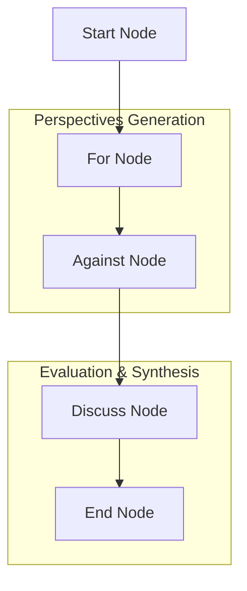

# Dialectical Debate Reasoning Pattern ⚖️🧠

A stateful multi-agent system demonstrating the **Dialectical Debate Reasoning Pattern** (Argue Both Sides) using `pydantic-ai` and `pydantic-graph`.

This architecture uses structured multi-agent cooperation to tackle highly complex problems, evaluate logical fallacies, rank arguments by strength, and synthesize balanced, holistic compromise proposals.

## Project Overview

This project implements a dialectical debate pipeline. When a hard problem or controversial topic is provided:
1. A **ProponentAgent** constructs a compelling, persuasive case **FOR** the thesis.
2. An **OpponentAgent** constructs a structured case **AGAINST** the thesis.
3. A **JudgeAgent** reviews the debate, checks both sides for logical fallacies, ranks and grades the arguments by strength, and synthesizes a final balanced verdict.

### Architectural Workflow

The workflow is managed via a stateful, strongly typed node graph:



1. **StartNode**: Initializes the dialectical debate processing pipeline state.
2. **ForNode**: Invokes the `ProponentAgent` to construct arguments supporting the thesis, saving them to `State.arguments_for`.
3. **AgainstNode**: Invokes the `OpponentAgent` to construct opposing arguments and counter-assertions, saving them to `State.arguments_against`.
4. **DiscussNode**: Invokes the `JudgeAgent` with the complete debate history. The Judge produces a structured, strongly typed **Verdict** including logical checks, ranked points, and a comprehensive synthesis proposal.
5. **EndNode**: Evaluates the structured verdict, ranks points by strength rank, performs a final logic evaluation check, and presents a beautiful **Debate Analysis and Judge Verdict Report** to the console.

## Technology Stack

- **Framework**: [pydantic-ai](https://ai.pydantic.dev/) & [pydantic-graph](https://ai.pydantic.dev/graph/)
- **LLM Provider**: Azure OpenAI (configured with robust, high-fidelity offline mock fallback)
- **Environment**: Python 3.13+, managed via `uv`

## Project Structure

- `main.py`: Entry point running the showcase on the global regulation of AGI.
- `agentic_system/`:
    - `graph.py`: Defines the 5-node state graph (Start ➡️ For ➡️ Against ➡️ Discuss ➡️ End) and execution flow.
    - `agents.py`: Implementations for the `ProponentAgent`, `OpponentAgent`, and the structured output `JudgeAgent`.
    - `models.py`: Shared memory `State` (topic, arguments for, arguments against, verdict) and dependencies, including the strongly typed `LogicalCheck`, `PointRating`, and `Verdict` structures.
    - `prompts.py`: Expert system prompts for Proponent, Opponent, and Judge personas.
    - `config.py`: Azure OpenAI configuration.

## Getting Started

### 1. Configuration
To run with live Azure OpenAI services, configure the `.env` file in the project root:
```ini
AZURE_OPENAI_ENDPOINT=https://your-endpoint.openai.azure.com/
AZURE_OPENAI_API_KEY=your-api-key
AZURE_OPENAI_API_VERSION=2024-12-01-preview
AZURE_OPENAI_CHAT_DEPLOYMENT_NAME=gpt-5-mini
```

*Note: If no Azure credentials are configured, the system gracefully falls back to high-fidelity offline mock execution to demonstrate the flow immediately.*

### 2. Installation & Run
Run the dialectical debate showcase with `uv`:
```bash
uv run main.py
```
