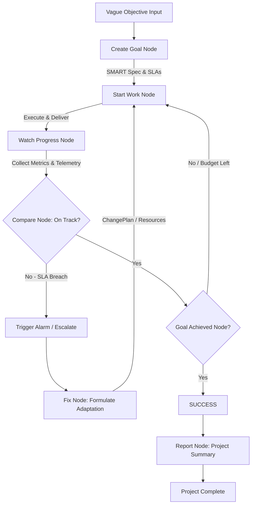

# Goal Setting & Monitoring Pattern 🎯📈

A robust, premium agentic orchestrator implementing the **Goal Setting & Monitoring Design Pattern** powered by `pydantic-ai` and `pydantic-graph`. 

The system guides multi-agent workflows through structured execution: establishing specific SLA goals, conducting engineering tasks, auditing real-time telemetry metrics, dynamically catching SLA deviations, triggering self-healing adaptation loops, and publishing detailed project completion reports.

---

## 🌟 Modern Design Pattern Architecture

Rather than performing tasks blindly, this system operates under a continuous telemetry feedback loop to guarantee quality, performance, and budget constraints:



---

## 🛠️ Orchestrator State Machine Nodes

The orchestrator utilizes **Pydantic Graph** to govern state transitions through 7 core nodes:

1. **`CreateGoalNode`**: Translates user requirements into a concrete **SMART Goal Specification** (Specific, Measurable, Achievable, Relevant, Limits, and Quality Standard SLAs).
2. **`StartWorkNode`**: Directs the system's engineering agent to perform the targeted tasks for the current turn.
3. **`WatchProgressNode`**: Collects runtime telemetry data (e.g., database read latencies, data accuracy metrics, credit consumption logs).
4. **`CompareNode`**: Audits measured metrics against defined SLAs. Dynamically sounds an alarm if standards are violated (e.g., database read latency exceeds the `50ms` SLA).
5. **`FixNode`**: Evaluates the root cause of off-track runs and selects an optimal adaptation strategy (e.g., `ChangePlan` to implement database indexing, replication, or Redis caching).
6. **`GoalAchievedNode`**: Assesses whether quality targets are fully satisfied, monitoring deadlines and resource limits to make stop-or-continue decisions.
7. **`ReportNode`**: Compiles and logs a comprehensive **Project Complete Monitoring Report** tracking step history, credits consumed, and final SLA status.

---

## 🚀 Getting Started

### 📋 Prerequisites

- **Python 3.11+** (Python 3.13 recommended)
- **Azure OpenAI Service API** (Optional; high-fidelity offline fallback mocks are enabled automatically if credentials are not provided).

### ⚙️ Quick Installation

1. **Clone the repository and set up a virtual environment**:
   ```powershell
   python -m venv .venv
   .venv\Scripts\Activate.ps1
   ```

2. **Install project dependencies**:
   ```powershell
   pip install -e .
   ```

3. **Configure Environment Variables**:
   Create a `.env` file in the root directory to run with Azure OpenAI models:
   ```env
   AZURE_OPENAI_ENDPOINT=https://your-endpoint.openai.azure.com/
   AZURE_OPENAI_API_KEY=your-api-key
   AZURE_OPENAI_API_VERSION=2024-12-01-preview
   AZURE_OPENAI_CHAT_DEPLOYMENT_NAME=gpt-4o-mini
   ```

---

## 🧪 Running the Showcase

To drive the self-monitoring simulation, execute the main entrypoint:

```powershell
python main.py
```

### 🔁 The Simulated Scenario (Supply-Chain Point-Reads)
The showcase runs a simulated point-read workload scenario targeting **10,000 SKUs and 5 Warehouses** under a rigid SLA constraint:
- **Turn 1 (Establish Base DB Schema)**: Base Postgres tables are created. Telemetry reveals a **database latency spike of 120ms** (breaching the `< 50ms` SLA constraint). 
- **Compare & Fix Nodes**: The orchestrator triggers an alarm, analyzes the latency spike, and formulates a `ChangePlan` adaptation: *implementing an atomic Redis cache-aside invalidation architecture*.
- **Turn 2 (Execute Caching Adaptation)**: The caching architecture is deployed. The telemetry monitor detects **latency dropping to 15ms** and **data accuracy hitting 99.1%** (satisfying all SLA constraints).
- **Goal Achieved Node**: Successfully flags achievement, stops work, and logs the final complete report.

---

## 📂 Project Structure

```
├── agentic_system/
│   ├── __init__.py
│   ├── config.py       # Configuration and Azure OpenAI client setup
│   ├── models.py       # SMART Goal specs, TelemetryMetrics, state models
│   ├── prompts.py      # System prompts and simulated turn telemetry metrics
│   ├── agents.py       # GoalCreator, Worker, Monitor, and Adapter agents
│   └── graph.py        # pydantic-graph Orchestrator node routing definitions
├── main.py             # Entrypoint driving the showcase run loop
├── README.md           # This premium documentation
├── about.md            # Goal Setting & Monitoring design patterns guide
└── diagram.mmd         # Mermaid flowchart diagram
```

---

## 🛡️ Robust Portability & Fallbacks

- **High-Fidelity Mocks**: When `AZURE_OPENAI_API_KEY` is not detected in `.env`, the system automatically runs using high-fidelity offline mock agents that replicate identical SLA states, allowing local development and offline showcase evaluations.
- **Pydantic Tool Schema Validation**: Implements explicit Pydantic model definitions (`TelemetryMetrics` with dictionary-like accessor methods) to ensure 100% reliable structured tool-calling schema parsing across all OpenAI / Azure LLM models.
- **Self-Healing Retries**: Wrapper agents use configured validation retries (`retries=3`) to automatically correct and recover from temporary JSON formatting errors.
